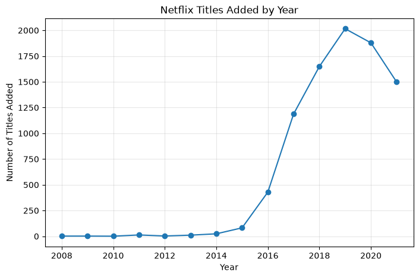

# EDA
## titanic data analysis (file: analysedData/titanic.csv )
### What I Did
- Checked data quality with `.info()` and `.isnull().sum()`
- Handled missing values: filled Age with median, Cabin/Embarked with placeholder
- Analyzed survival rate by Sex using `.groupby()`
- Analyzed survival rate by Pclass using `.groupby()`
- Exported cleaned dataset to `analysedData/titanic.csv`
### Key Findings
1. **Gender gap in survival**: Women survived at ~74%, men at ~19% — 
   suggesting a "women and children first" evacuation pattern.
2. **Class gap in survival**: 1st class passengers survived at ~63%, 
   dropping to ~24% for 3rd class — likely reflecting cabin location 
   and priority access to lifeboats.

## netflix data analysis
### what i did 
- converted to proper date format `pd.datetime()` 
- drop the title which didn't have date `.dropna()`
- done 1NF (normalization) in `date_added` column for EDA
- Found top five genres
### Key Finding
1. **Top Five Genre**:
   1. International Movies
   2. Dramas
   3. Comedies
   4. International TV Shows
   5. Documentaries
2. **Realesed Titles Each year**:
   

